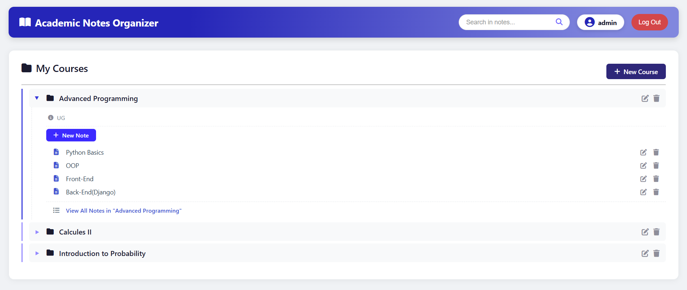
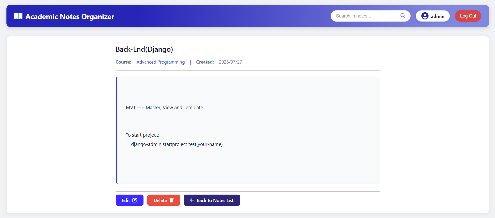
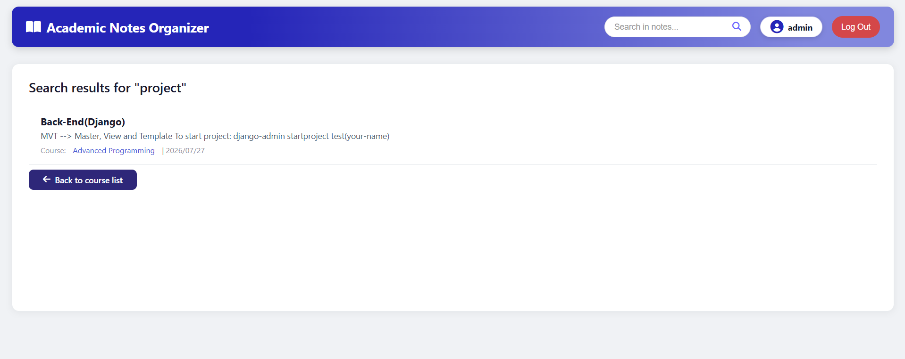

# 📚 Academic Notes Organizer

A Django-based web application for university students to organize, manage, and access their course notes and study materials with a familiar file explorer-like interface.


## ✨ Features

### Core Features
- **User Authentication** – Secure signup, login, and logout using Django's built-in authentication
- **Course Management** – Create, read, update, and delete courses (like folders)
- **Note Management** – Create, read, update, and delete notes inside each course (like files)
- **File Explorer UI** – Tree-based interface with expandable folders and file items
- **Full-Text Search** – Search across note titles and content with instant results
- **Note Detail View** – Full-page view for reading complete notes with formatting
- **File Attachments** – Upload and download files (PDF, images, Word, etc.) for each note
- **Unit Testing** – Comprehensive test suite for models, views, and forms

## 🛠️ Technologies Used

| Technology | Purpose |
|------------|---------|
| **Django 6.0** | Backend framework (MVT architecture) |
| **SQLite** | Default database (lightweight, no setup needed) |
| **HTML5 & CSS3** | Frontend structure and styling |
| **Django Templates** | Server-side templating with template inheritance |
| **Font Awesome 6** | Icon library for UI enhancement |
| **Django Test Framework** | Unit testing for models, views, and forms |
| **Pillow** | Image/file handling support |


## 🚀 Installation & Setup

### Prerequisites

- **Python 3.8** or higher
- **pip** (Python package manager)
- **Git** (for cloning)

### Step-by-Step Installation

#### 1. Clone the Repository
```bash
git clone https://github.com/RoohiDev/academic-notes-organizer.git
cd academic-notes-organizer
```

#### 2. Create and Activate a Virtual Environment

**Windows:**
```bash
python -m venv venv
venv\Scripts\activate.bat
```

**macOS / Linux:**
```bash
python3 -m venv venv
source venv/bin/activate
```
*You should see `(venv)` at the beginning of your terminal prompt.*

#### 3. Install Dependencies
```bash
pip install -r requirements.txt
```

#### 4. Apply Database Migrations
```bash
python manage.py makemigrations
python manage.py migrate
```

#### 5. Create a Superuser (Optional)
```bash
python manage.py createsuperuser
```
Follow the prompts to set up an admin account for accessing the Django admin panel at `/admin/`.

#### 6. Run the Development Server
```bash
python manage.py runserver
```

#### 7. Access the Application
Open your browser and go to: `http://127.0.0.1:8000`


## 🧪 Running Tests

To ensure everything works correctly, run the test suite:

```bash
python manage.py test notes
```

**Expected Output:**
```text
Ran 27 tests in X.XXXs

OK
```

## 📸 Screenshots

- **Main Dashboard** – Tree-based course view with expandable folders


- **Note Detail** – Full-page view with action buttons

- **Search Results** – Highlighted matching notes with course context

## 👨‍💻 Developer

**Amirhossein Rouhi Kalourazi**  
**Course:** Advanced Programming – Final Project  
**University:** University of Guilan  
**Date:** July 2026  

## 📜 License

This project is licensed under the MIT License